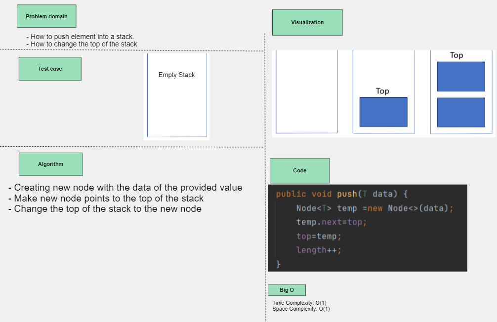
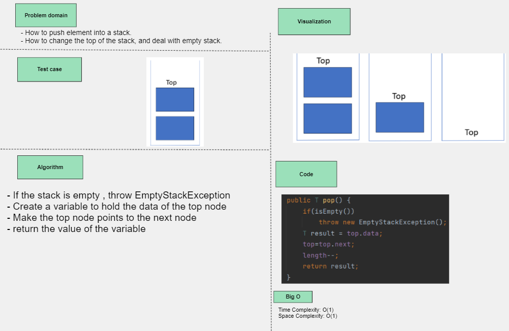

## Stack and Queue

- *Stack implementation*
- **push(data)**

## Whiteboard Process

## Approach & Efficiency
- Create a new node and make it points to the top of the stack, then change the top pointer of the stack to the nes node.
- increase the length of the stack
- Time/Space complexity O(1)
## Solution

- **pop()**

## Whiteboard Process

## Approach & Efficiency
- If the stack is empty, throw EmptyStackException
- save the value of the top of the stack to a variable
- make the top points to the next node
- return the value of the variable
- Time/Space complexity O(1)
- decrease the length of the stack
## Solution

- **isEmpty**
## Approach & Efficiency
- boolean method, return *true* if length>0, else return false 
- Time/Space complexity O(1)

- **peak**
## Approach & Efficiency
-  return the value of the top, which is the last element pushed to the stack
- Time/Space complexity O(1)