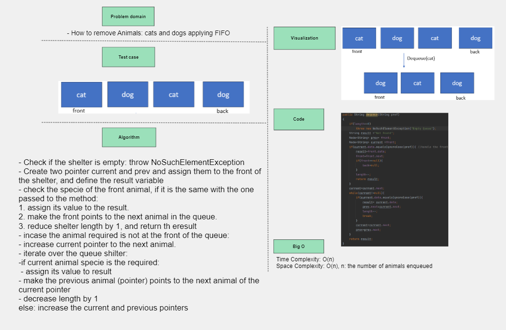

## Animal Shelter Queue
It is a shelter for Animals of cats and dogs only, it includes:
1. Animal class with two attributes: *species* and *name*.
2. AnimalShelter class that implement queue and dequeue cats and dogs ensuring *F-I-FO*. 

- **enqueue(Animal)**
- enqueue Animal from the shelter ensuring *F-I-F-O*, where Animal species is either dog or cat.

## Whiteboard Process

## Approach & Efficiency
- Check if the Animal species is not cat or dog: return null. 
- Check if the shelter is empty: insert the Animal and make the front and back point to it.
- if the shelter is not empty: insert the Animal at the back of the shelter queue
- increase the shelter length by 1.
- *Time complexity O(1)*
- *Space complexity O(n)*
---
- **dequeue(pref)**
dequeue a pref from the shelter ensuring *F-I-F-O*, where pref is string either dog or cat.
## Whiteboard Process

## Approach & Efficiency
- Check if the shelter is empty: throw NoSuchElementException
- Create two pointer current and prev and assign them to the front of the shelter, and define the result variable
- check the specie of the front animal, if it is the same with the one passed to the method:
1. assign its value to the result.
2. make the front points to the next animal in the queue.
3. reduce shelter length by 1, and return the result.
- encase the animal required is not at the front of the queue:
- increase current pointer to the next animal.
- iterate over the queue shelter:
- if current animal specie is the required:
- assign its value to result
- make the previous animal (pointer) points to the next animal of the current pointer
- decrease length by 1, and return the result.
- else: increase the current and previous pointers
- *Time/Space complexity O(n)*

## Solution

