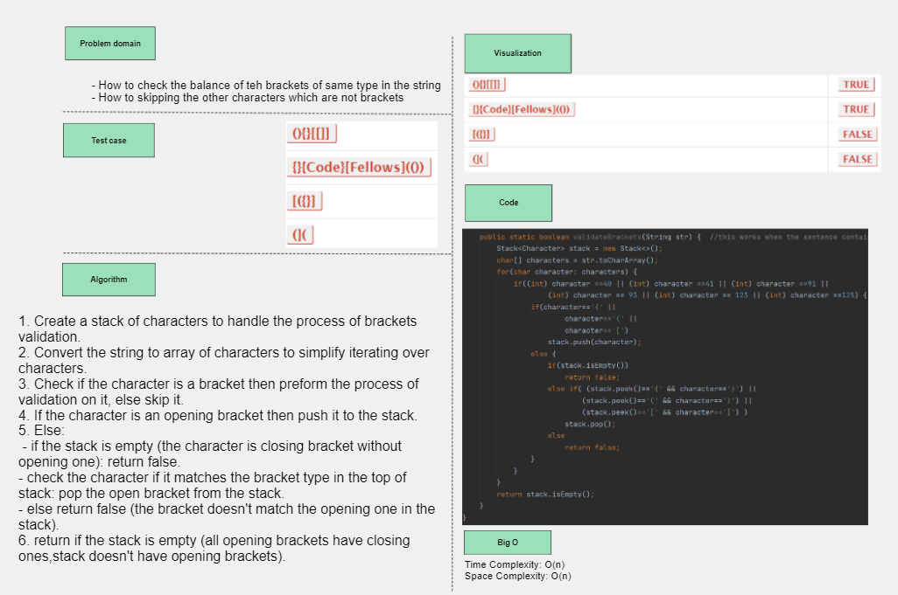
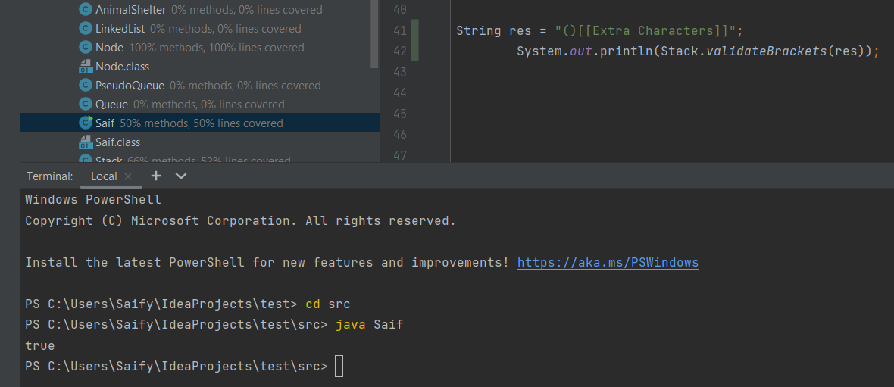
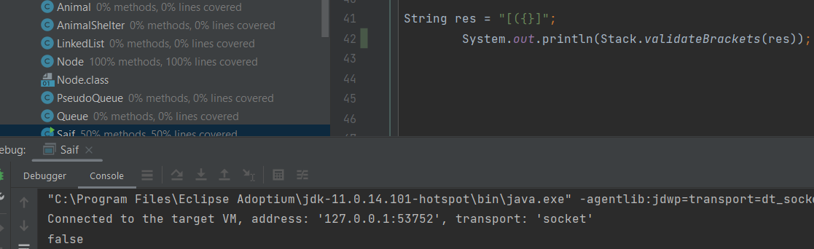

## Validate Brackets
it is a function that checks the balance of the opening and closing brackets in a sentence.

## Whiteboard Process

## Approach & Efficiency
1. Create a stack of characters to handle the process of brackets validation.
2. Convert the string to array of characters to simplify iterating over characters.
3. Check if the character is a bracket then preform the process of validation on it, else skip it.
4. If the character is an opening bracket then push it to the stack.
5. Else(the character is closing bracket): 
- if the stack is empty (the character is closing bracket without opening one): return false.
- check the character if it matches the bracket type in the top of stack: pop the open bracket from the stack.
- else return false (the bracket doesn't match the opening one in the stack).
6. return if the stack is empty (all opening brackets have closing ones, stack doesn't have opening brackets).

- *Time/Space complexity: O(n)*

## Solution

