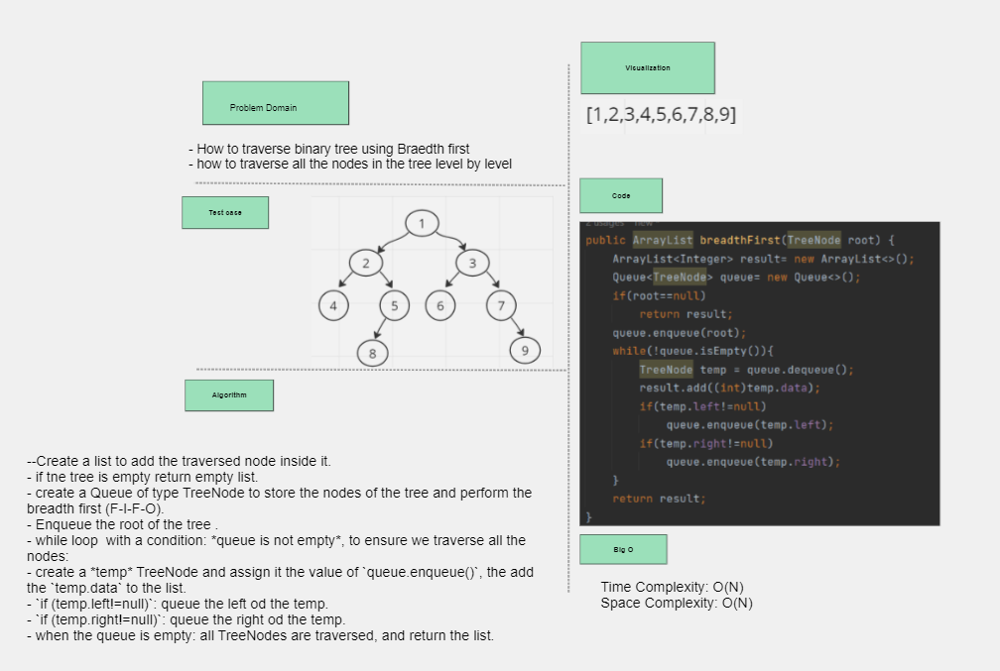
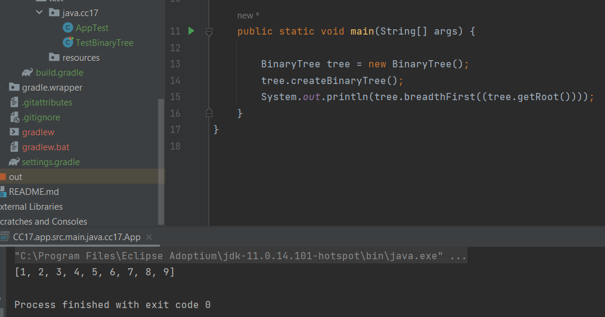

## Binary Tree Breadth First
Traverse the Binary Tree Level By Level

## Whiteboard Process

## Approach and Efficiency
- Create a list to add the traversed node inside it.
- if tne tree is empty return empty list.
- create a Queue of type TreeNode to store the nodes of the tree and perform the breadth first (F-I-F-O).
- Enqueue the root of the tree .
- while loop  with a condition: *queue is not empty*, to ensure we traverse all the nodes:
- create a *temp* TreeNode and assign it the value of `queue.enqueue()`, the add the `temp.data` to the list.
- `if (temp.left!=null)`: queue the left od the temp.
- `if (temp.right!=null)`: queue the right od the temp.
- when the queue is empty: all TreeNodes are traversed, and return the list.
- Time Complexity: O(N)
- Space Complexity: O(N)
## Solution
