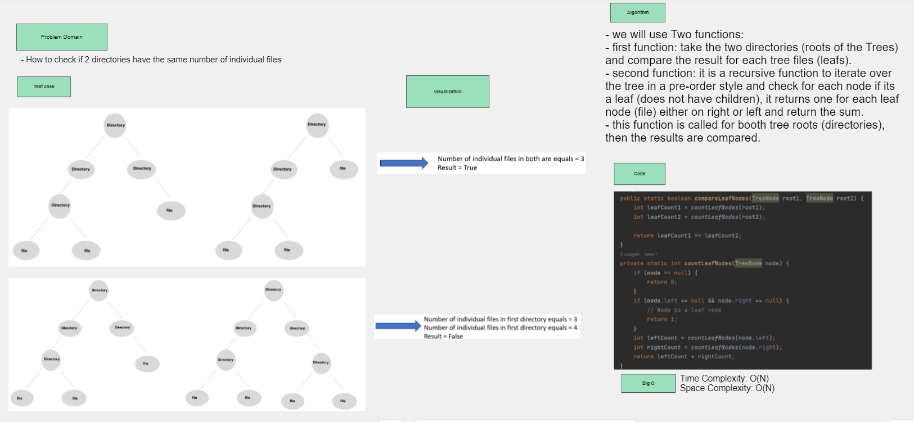
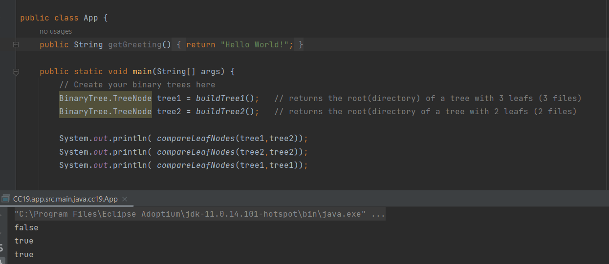

## Compare two Binary Trees leafs 
It simulates comparing between two directories, find the individual files in each directory and compare if they are equal.
## Whiteboard Process

## Approach and Efficiency
- we will use Two functions:
- first function: take the two directories (roots of the Trees) and compare the result for each tree files (leafs).
- second function: it is a recursive function to iterate over the tree in a pre-order style and check for each node if its a leaf (does not have children), it returns one for each leaf node (file) either on right or left and return the sum.
- this function is called for booth tree roots (directories), then the results are compared.
- Time Complexity: O(N)
- Space Complexity: O(N)
## Solution
