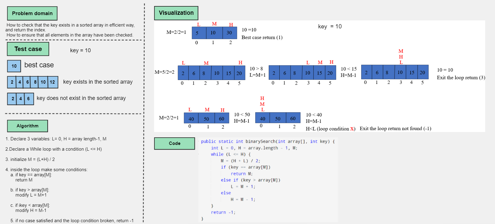
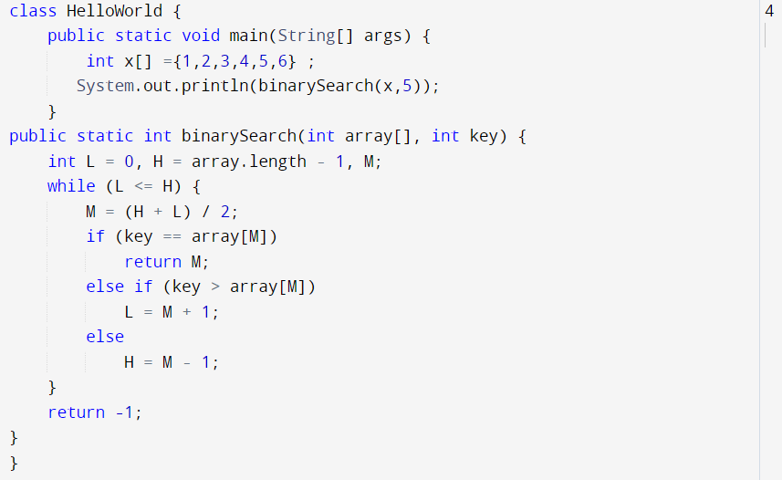
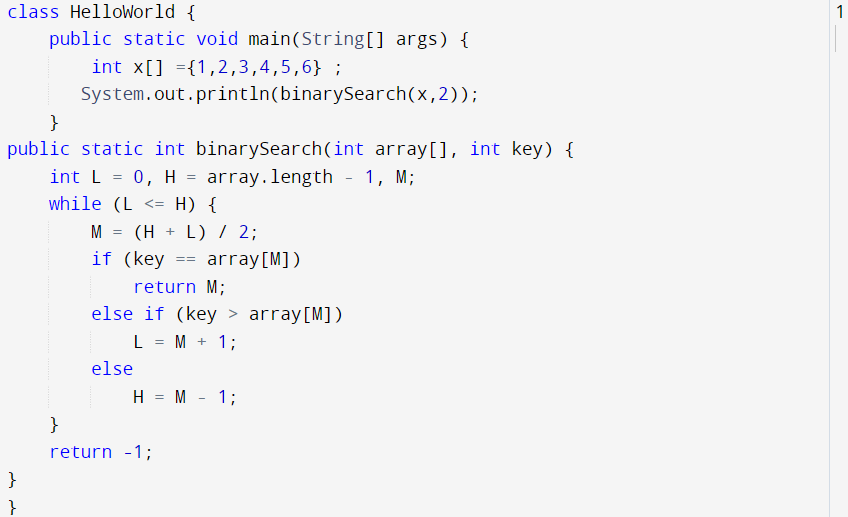
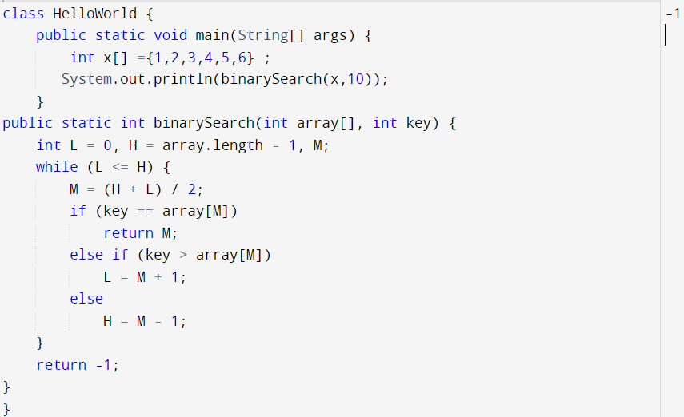

# array-binary-search
Write a function called binarySearch which takes in 2 parameters: a sorted array and the search key. Without utilizing any of the built-in methods available to your language, return the index of the array’s element that is equal to the value of the search key, or -1 if the element is not in the array.

## Whiteboard Process

## Approach & Efficiency
- Approach
1. Declare 3 variables: L= 0, H = array length-1, M.
2. Declare a While loop with a condition (L <= H).
3. initialize M = (L+H) / 2 .
4. inside the loop make some conditions:
    a. if key == array[M]:
        return M
    b. if key > array[M]:
        modify L = M+1
    c. if ikey < array[M]:
        modify H = M-1
5. if no case satisfied and the loop condition broken, return -1.
- Efficiency
Time: O(log n)
space: O(1)

## Solution

