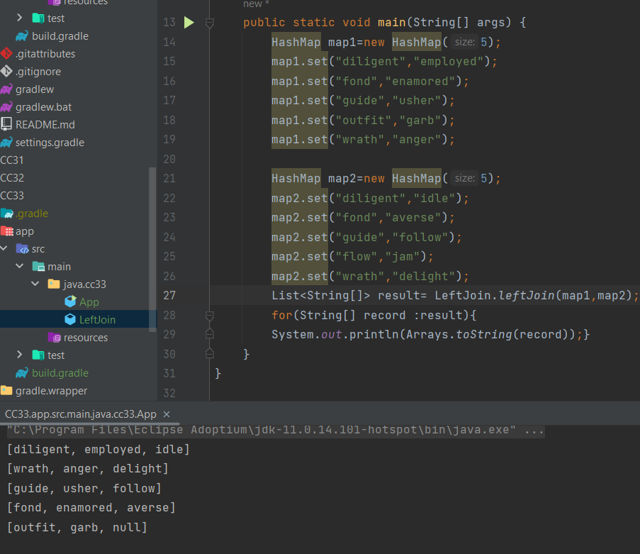

## left-join Hashmap
function takes two Hashmaps and joins them (left-join) in one table, based on map1.key=map2.key

## Whiteboard process

## Approach and Efficiency
- Iterating over the keys of map1, storing the key, value of the key from map1 and value of the key from map1 (if the key exists in map2, else the value is null) into an inner list which 
represents the columns of the table.
- after each iteration the columns are inserted in the table list (result list).
- space complexity is O(n), n: size of map1.
- time complexity is O(n*m), n,m: size of map1 and map2 respectively.

## Solution
