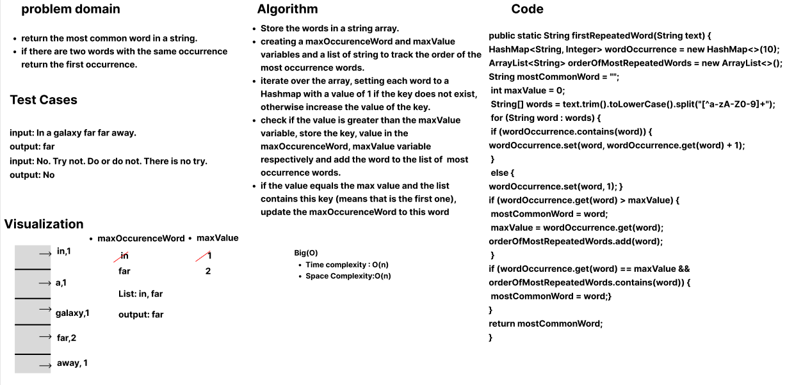
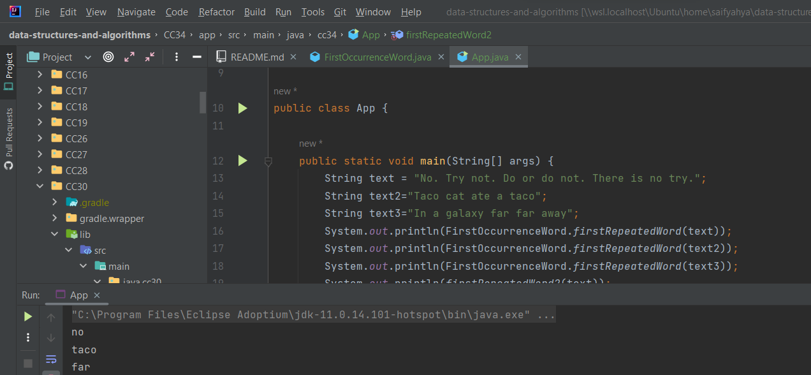

## first-most-repeated-word

This is a function uses Hashmap to find the first most occurrence word in a string.

## Whiteboard process

## Approach and Efficiency

- Store the words in a string array.
- creating a maxOccurrenceWord and maxValue variables and a list of string to track the order of the most occurrence words.
- iterate over the array, setting each word to a Hashmap with a value of 1 if the key does not exist, otherwise increase the value of the key.
- check if the value is greater than the maxValue variable, store the key, value in the maxOccurrenceWord, maxValue variable respectively and add the word to the list of most occurrence words.
- if the value equals the max value and the list contains this key (means that is the first one), update the maxOccurrenceWord to this word.
- Time complexity : O(n) , n: number of  words
- Space Complexity: O(n), n: number of unique words

## Solution

