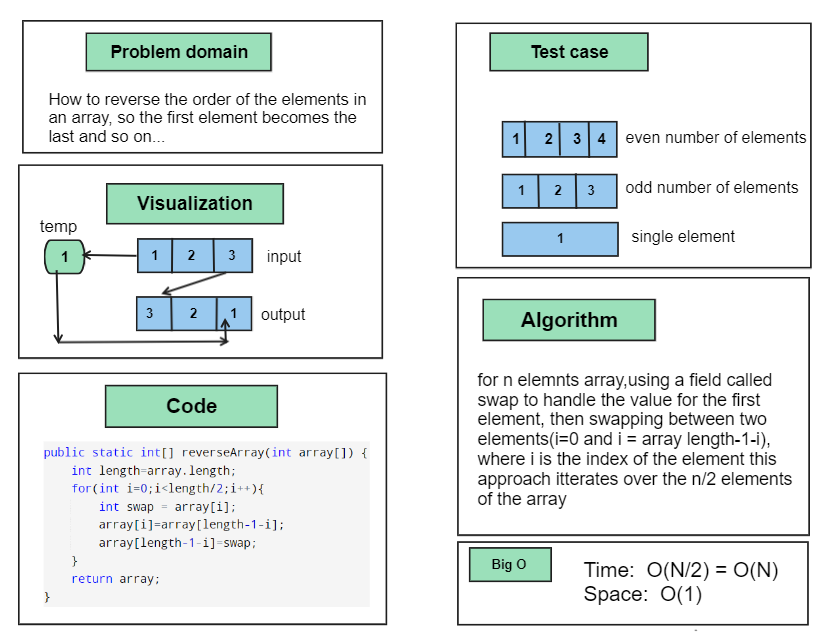
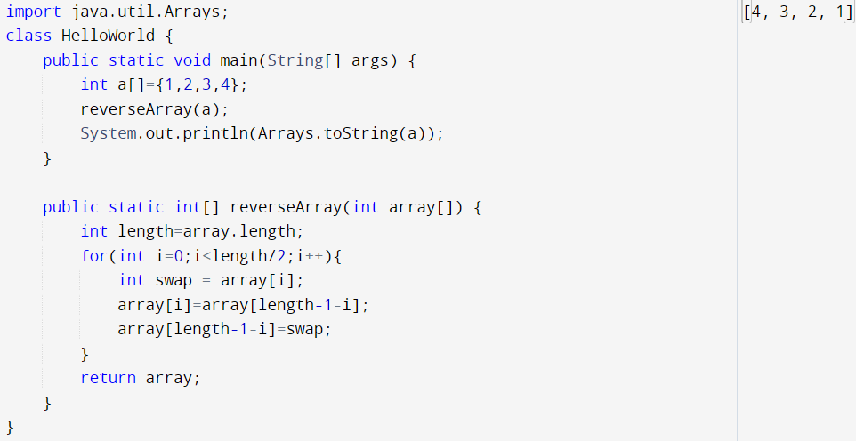

# Array reverse
a function called reverseArray which takes an array as an argument. Without utilizing any of the built-in methods, return an array with elements in reversed order.

## Whiteboard Process

## Approach & Efficiency
approach
- A for loop that iterates from the beginning of the array (index 0) to the middle of the array (array.length / 2)

- Inside the loop,perform the swap operation. swap the element at the current index with the corresponding element from the end of the array. For example, swap the element at index i with the element at index array.length - i - 1

- By the time the loop reaches the middle of the array, all elements have been swapped, resulting in the reversed array.

## Solution
