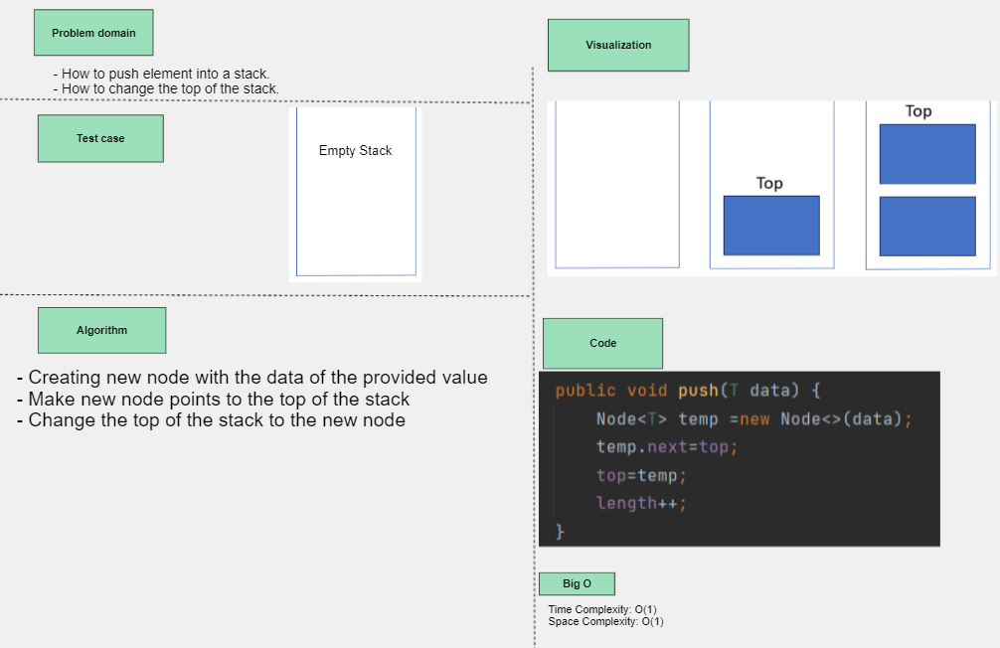
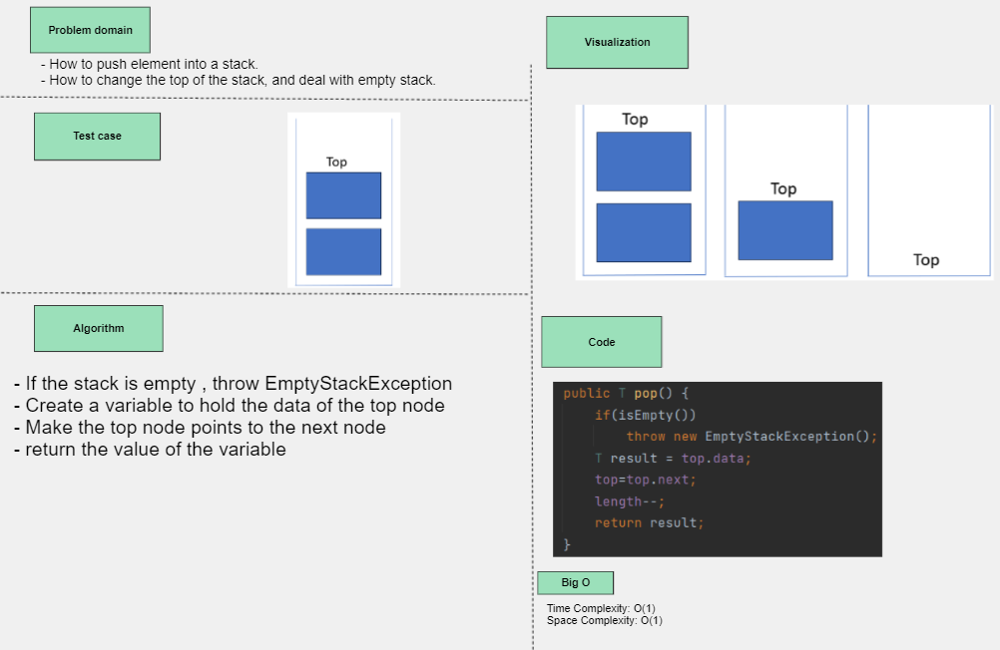
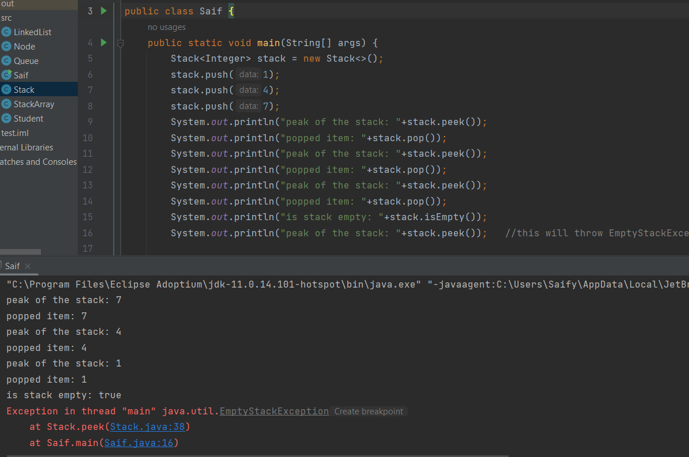
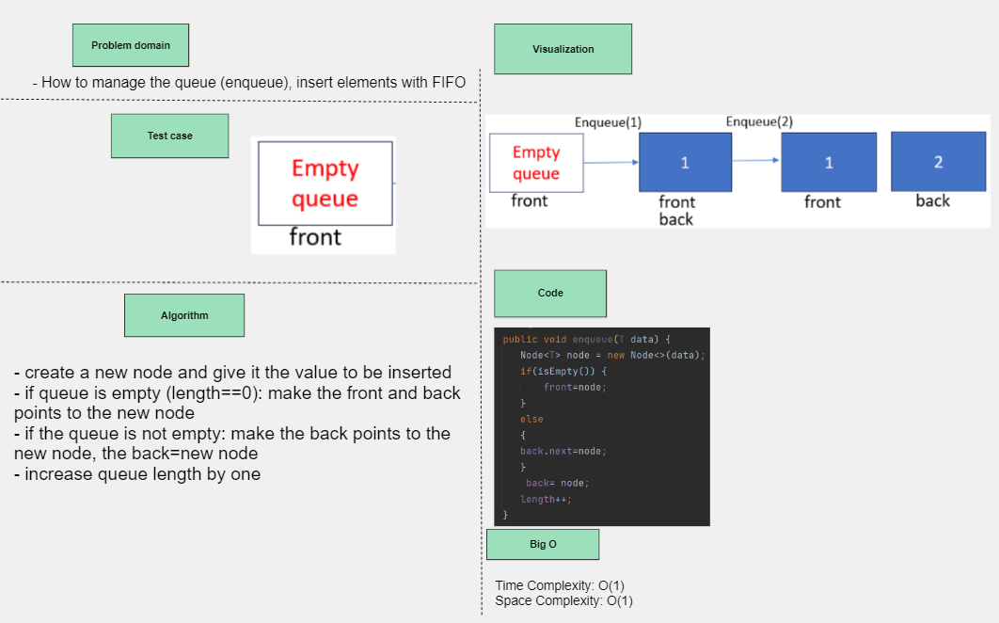
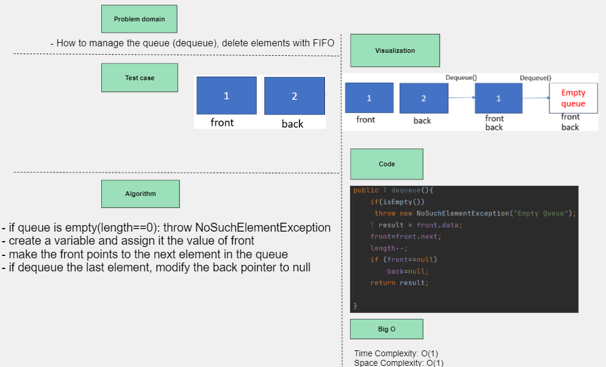
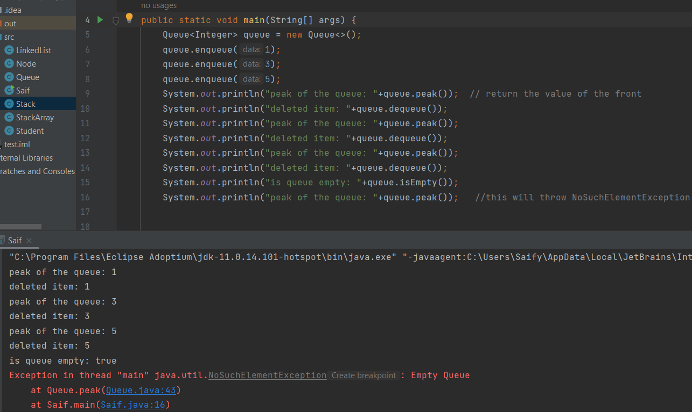

## Stack and Queue

- **Stack implementation (LIFO)**
- **push(data)**
## Whiteboard Process

## Approach & Efficiency
- Create a new node and make it points to the top of the stack, then change the top pointer of the stack to the nes node.
- increase the length of the stack
- Time/Space complexity O(1)

- **pop()**
## Whiteboard Process

## Approach & Efficiency
- If the stack is empty, throw EmptyStackException
- save the value of the top of the stack to a variable
- make the top points to the next node
- return the value of the variable
- Time/Space complexity O(1)
- decrease the length of the stack

- **isEmpty**
## Approach & Efficiency
- boolean method, return `length==0`
- Time/Space complexity O(1)

- **peak**
## Approach & Efficiency
- If the stack is empty, throw EmptyStackException
-  return the value of the top, which is the last element pushed to the stack
- Time/Space complexity O(1)

## Solution

---

- *Queue implementation (FIFO)*
- **enqueue(data)**
## Whiteboard Process

## Approach & Efficiency
- Create a new node with the value to be inserted
- if the queue is empty (length==0): make the front and back pointers point to the new node
- if the queue is not empty: make the back points to the new node, and make back = the new node
- increase queue length by one
- Time/Space complexity O(1)

- **dequeue()**
## Whiteboard Process

## Approach & Efficiency
- if queue is empty(length==0): throw NoSuchElementException
- create a variable and assign it the value of front
- make the front points to the next element in the queue
- if dequeue the last element, modify the back pointer to null
- decrease the length of the queue by one
- Time/Space complexity O(1)

- **isEmpty**
## Approach & Efficiency
- boolean method, return `length==0`
- Time/Space complexity O(1)

- **peak**
## Approach & Efficiency
- If the stack is empty, `throw NoSuchElementException("Empty Queue")`
-  return the value of the front pointer
- Time/Space complexity O(1)

## Solution
