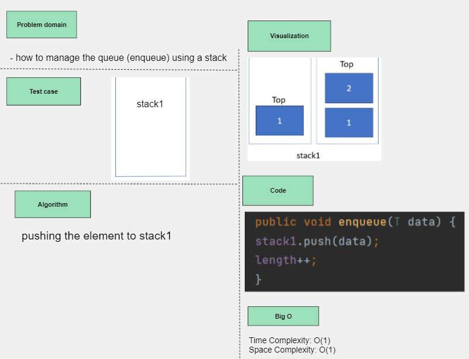
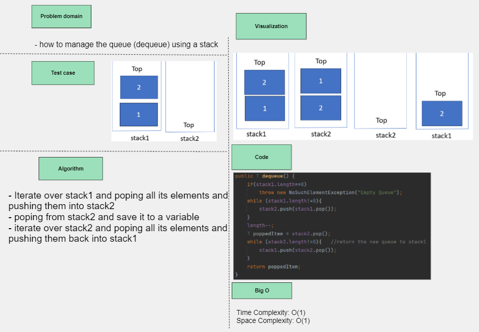
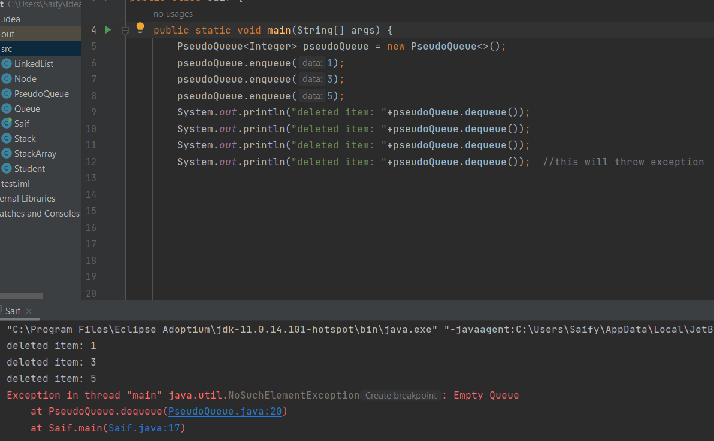

## Pseudo Queue
Implement the Queue(enqueue and dequeue) using two stacks: stack1 and stack2.

1. **enqueue(data)**
## Whiteboard Process

## Approach & Efficiency
- pushing the element to stack1.
- Time complexity O(1), space complexity O(1)

2. **dequeue()** 
## Whiteboard Process

## Approach & Efficiency
- Iterate over stack1 and popping all its elements and pushing them into stack2
- popping from stack2 and save it to a variable
- iterate over stack2 and popping all its elements and pushing them back into stack1
- Time complexity O(n), space complexity O(1)

## Solution
