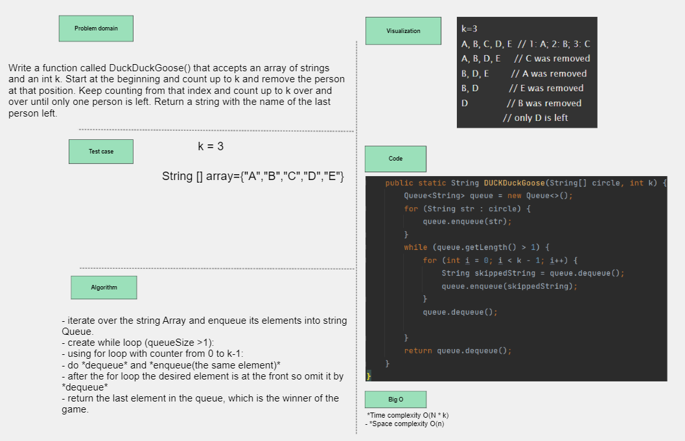
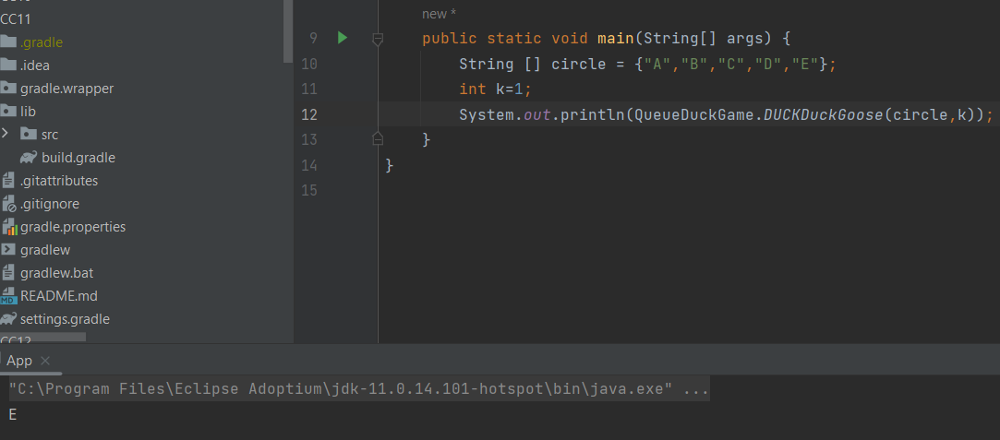
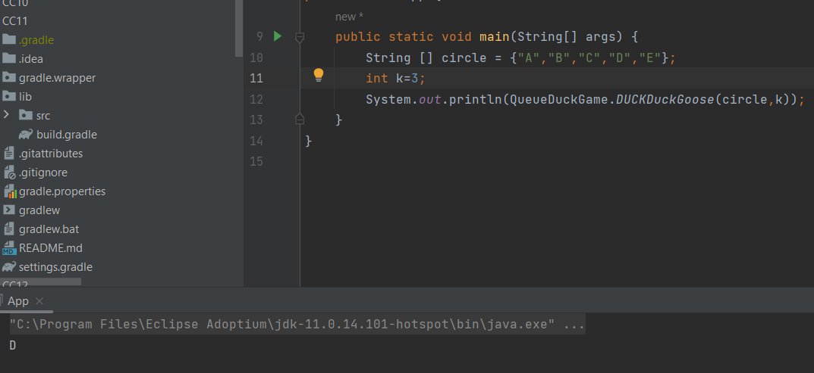

## Queue Duck Dose Game
DuckDuckGoose() function accepts an array of strings and an int k. Start at the beginning and count up to k and remove the person at that position. Keep counting from that index and count up to k over and over until only one person is left. Return a string with the name of the last person left.

## Whiteboard Process

## Approach & Efficiency
- iterate over the string Array and enqueue its elements into string Queue.
- create while loop (queueSize >1):
- using for loop with counter from 0 to k-1:
- do *dequeue* and *enqueue(the same element)*
- after the for loop the desired element is at the front so omit it by *dequeue*
- return the last element in the queue, which is the winner of the game.
- *Time complexity O(N * k)*
- *Space complexity O(n)*

## Solution

