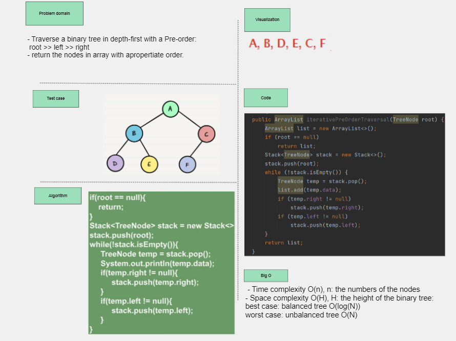
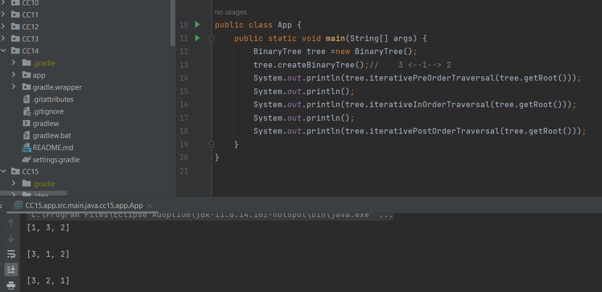
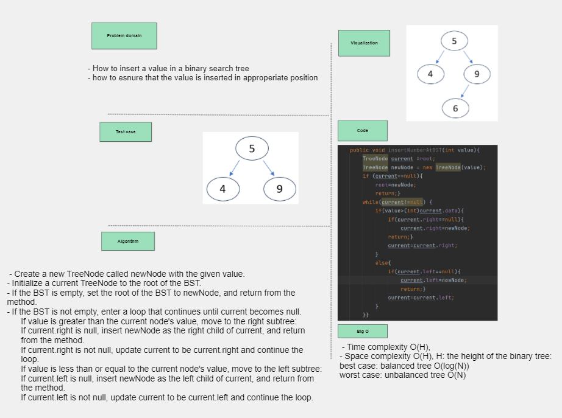
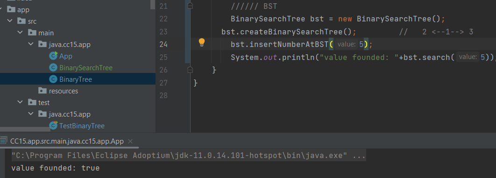

## Binary Tree

## Whiteboard Process

## Approach & Efficiency
*Pre-order*
1. *visit the root*
2. *visit the left subtree in pre-order*
3. *visit the right subtree in pre-order*
- we will use stack to store the root of the tree.
- we will use arraylist to represent the traversal output.
- push the root of the tree to the stack.
- use while loop with a condition: stack is not empty
- use TreeNode temp pointer = stack.pop().
- *add the `temp.data` to the list to represent the traversal output*
- if(temp.right!=null):stack.push(temp.right)
- if (temp.left!=null):stack.push(temp.left)
- after the stack is empty: return the list.
- Time complexity O(n), n: the numbers of the nodes
- Space complexity O(H), H: the height of the binary tree:
  1. best case: balanced tree O(log(N))
  2. worst case: unbalanced tree O(N)

## Approach & Efficiency
*In-order*
1. *visit the left subtree in in-order*
2. *visit the root*
3. *visit the right subtree in in-order*
- we will use stack to store the root of the tree.
- we will use arraylist to represent the traversal output.
- we will use TreeNode temp = root.
- use while loop with two conditions: *stack is not empty and temp!=null*.
- **if(temp!=null)** : *stack.push(temp), temp=temp.left*.
- **else** 
- *temp=stack.pop()*
- *list.add(temp.data)*
- *temp = temp.right*
- after the stack is empty: return the list.
- Time complexity O(n), n: the numbers of the nodes
- Space complexity O(H), H: the height of the binary tree:
    1. best case: balanced tree O(log(N))
    2. worst case: unbalanced tree O(N)

## Approach & Efficiency
*Post-order*
1. *visit the left subtree in in-order*
2. *visit the right subtree in in-order*
3. *visit the root*
- we will use stack to store the root of the tree.
- we will use arraylist to represent the traversal output.
- we will use TreeNode current = root.
- use while loop with two conditions: *stack is not empty and current!=null*.
- **if(current!=null)** : *stack.push(current), current=current.left*.
- **else**: we traverse the complete left subtree
- TreeNode temp = stack.peak().right.  *check if there are right children to traverse before traverse the root node*
- **if(temp==null)**: *temp = stack.pop(), list.add(temp.data)*  *no right child for the root node, and insert another while loop*
- *while(stack is not empty and temp == stack.peak().right)*  *check if the node is a right child for the one in the peak, so we can traverse it* 
- *temp=stack.pop(), list.add(temp.data)*
- **else**  *there are right children need to traverse* 
- *current = temp*  *apply the whole algorithm on this right child*
- after the stack is empty: return the list.
- Space complexity O(H), H: the height of the binary tree:
    1. best case: balanced tree O(log(N))
    2. worst case: unbalanced tree O(N)
  
## Solution

---
## Binary Search tree
- it is a Binary Tree but with sub-left tree nodes values less than the root node and sub-right tree nodes greater tha the root node, this condition must be applied for each node in the tree.

## Whiteboard process

## Approach & Efficiency
*search: boolean method*
- Initialize a current TreeNode to the root of the BST.
- If the BST is empty, return false.
- If the BST is not empty, enter a loop that continues until current becomes null.
  If value equals the current node's value, return true.
  If value is greater than the current node's value, move to the right subtree.
  If value is less than or equal to the current node's value, move to the left subtree:
- Space complexity /Time complexity O(H), H: the height of the binary tree:
  1. best case: balanced tree O(log(N))
  2. worst case: unbalanced tree O(N)

## Approach & Efficiency
*insert: void method*
- Create a new TreeNode called newNode with the given value.
- Initialize a current TreeNode to the root of the BST.
- If the BST is empty, set the root of the BST to newNode, and return from the method.
- If the BST is not empty, enter a loop that continues until current becomes null.
  If value is greater than the current node's value, move to the right subtree:
  If `current.right` is *null*, insert newNode as the right child of current, and return
  from the method.
  If `current.right` is *not null*, update current to be `current.right` and continue the
  loop.
  If value is less than or equal to the current node's value, move to the left subtree:
  If `current.left` is *null*, insert newNode as the left child of current, and return from
  the method.
  If `current.left` is *not null*, update current to be `current.left` and continue the loop
- Space complexity /Time complexity O(H), H: the height of the binary tree:
  1. best case: balanced tree O(log(N))
  2. worst case: unbalanced tree O(N)

## Solution
