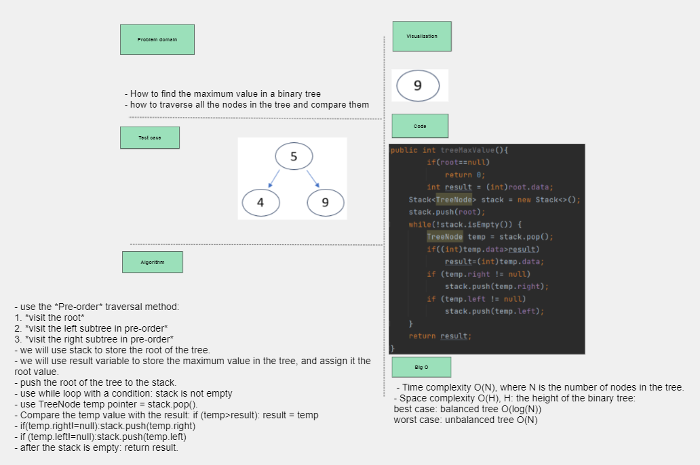
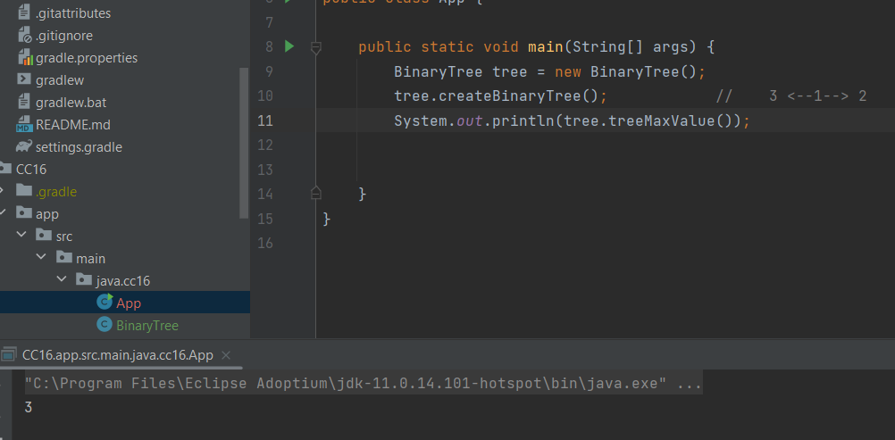

## Max Value in Binary Tree

## Whiteboard Process

## Approach and Efficiency
- use the *Pre-order* traversal method:
1. *visit the root*
2. *visit the left subtree in pre-order*
3. *visit the right subtree in pre-order*
- we will use stack to store the root of the tree.
- we will use result variable to store the maximum value in the tree, and assign it the root value.
- push the root of the tree to the stack.
- use while loop with a condition: stack is not empty
- use TreeNode temp pointer = stack.pop().
- Compare the temp value with the result: if (temp>result): result = temp
- if(temp.right!=null):stack.push(temp.right)
- if(temp.left!=null):stack.push(temp.left)
- after the stack is empty: return result.
- Time complexity O(n), n: the numbers of the nodes
- Space complexity O(H), H: the height of the binary tree:
    1. best case: balanced tree O(log(N))
    2. worst case: unbalanced tree O(N)

## Solution
