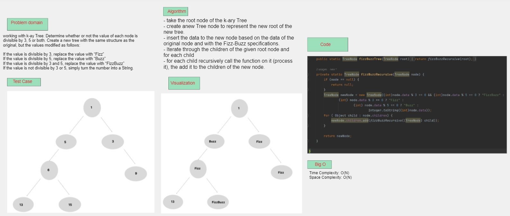
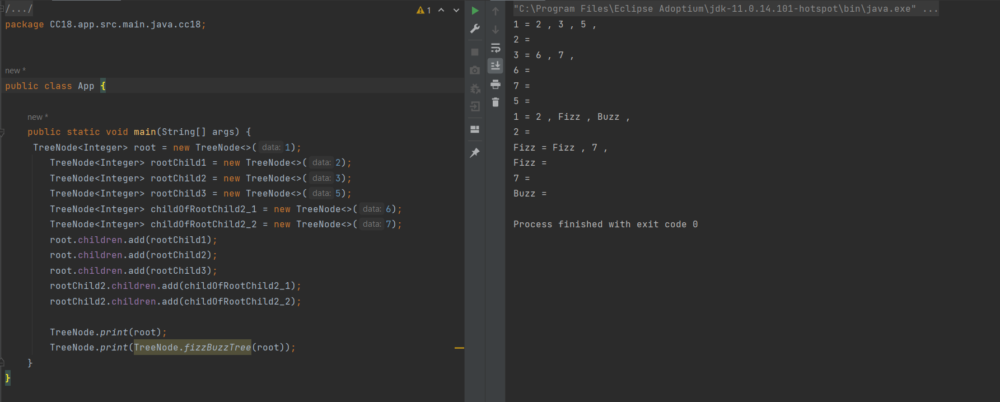

## K-ary Tree Fizz-Buzz
it is a function that check each node in k-ary Tree and return a new tree structured as the original one but with doing this processes:
- If the value is divisible by 3, replace the value with “Fizz”
- If the value is divisible by 5, replace the value with “Buzz”
- If the value is divisible by 3 and 5, replace the value with “FizzBuzz”
- If the value is not divisible by 3 or 5, simply turn the number into a String.

## Whiteboard Process

## Approach and Efficiency 
- take the root node of the k-ary Tree
- create anew Tree node to represent the new root of the new tree.
- insert the data to the new node based on the data of the original node and with the Fizz-Buzz specifications.
- Iterate through the children of the given root node and for each child
- for each child recursively call the function on it (process it), the add it to the children of the new node.
- Time/Space complexity: O(n).

## Solution
