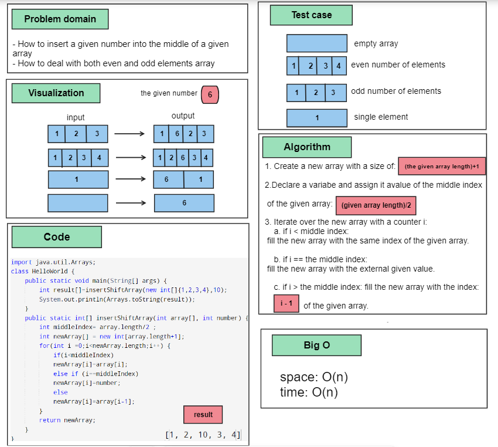
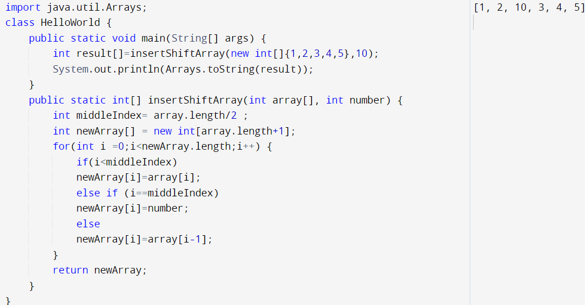

# Array-Insert-Shift
a function called insertShiftArray which takes an array as an argument and a number. Without utilizing any of the built-in methods, return the array with the number placed in the middle of it.

## Whiteboard Process

## Approach & Efficiency
1. Create a new array with a size of the given array + 1.
2. Declare a variabe and assign it avalue of the middle index of the given array.
3. Iterate over the new array with a counter i:
- if (i < middle index):
 fill the new array with the same index of the given array.
- if (i == the middle index):
 fill the new array with the external given value.
- if (i > the middle index): fill the new array with the index (i-1) of the given array.

## Solution
