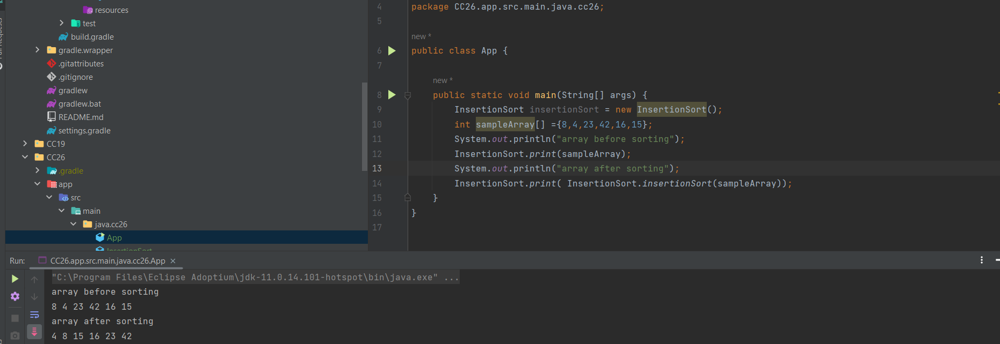

## Insertion-Sort 
This algorithm defines 2 functions:
1. Insert(int[] sorted, int value,  int numberOfSortedElements): This function inserts the value into a sorted array. It finds the correct position for value in the sorted array and shifts elements to make space for it. The i variable is used to traverse the number of sorted elements.
2. InsertionSort(int[] input): This function sorts an input array input using the Insertion Sort algorithm. It iterates through the elements in the input array, calling the Insert function to insert each element into a growing sorted array.
- This algorithm create *a new sorted array* from the input array.

## Pseudocode
` Insert(int[] sorted, int value, int numberOfSortedElements)
- initialize i to 0
- WHILE value > sorted[i]
- set i to i + 1
- WHILE i < sorted.length
- set temp to sorted[i]
- set sorted[i] to value
- set value to temp
- set i to i + 1

- InsertionSort(int[] input)
- LET sorted = New Empty Array
- sorted[0] = input[0]
- FOR i from 1 up to input.length
- Insert(sorted, input[i], i)
- return sorted`

## Blog Article

The first call for the insert function, after creating the new array **sorted** with only one element sorted which is the first element in the input array = `{8,0,0,0,0,0}`. the value passed = 4 and the number of sorted elements are 1.
The first while loop breaks when `i=0`, because the value is not greater than `sorted[0]` `4 > 8` .
The second while loop starts from `i=0`, put the value which is 4 at `sorted[0]` and continue shifting the remaining elements until `i < 6`.

The second call for the insert function, two elements sorted in the input array = `{4,8,0,0,0,0}`. the value passed = 23 and the number of sorted elements are 2.
The first while loop breaks when `i=2`, because the value i =2 not less than the number of sorted elements.
The second while loop starts from `i=2`, put the value which is 23 at `sorted[2]` and continue shifting the remaining elements until `i < 6`.

The third call for the insert function, three elements sorted in the input array = `{4,8,23,0,0,0}`. the value passed = 42 and the number of sorted elements are 3.
The first while loop breaks when `i=3`, because the value i =3 not less than the number of sorted elements.
The second while loop starts from `i=3`, put the value which is 42 at `sorted[3]` and continue shifting the remaining elements until `i < 6`.

The fourth call for the insert function, four elements sorted in the input array = `{4,8,23,42,0,0}`. the value passed = 16 and the number of sorted elements are 4.
The first while loop breaks when `i=2`, because the value is not greater than `sorted[2]` `16 > 23`.
The second while loop starts from `i=2`, put the value which is 16 at `sorted[2]` and continue shifting the remaining elements until `i < 6`.

The fifth call for the insert function, five elements sorted in the input array = `{4,8,16,23,42,0}`. the value passed = 15 and the number of sorted elements are 5.
The first while loop breaks when `i=2`, because the value is not greater than `sorted[2]` `15 > 16`.
The second while loop starts from `i=2`, put the value which is 15 at `sorted[2]` and continue shifting the remaining elements until `i < 6`.

- The output of the insert method will be a new sorted array `int [] sorted = {4,8,15,16,23,42}`

## Efficiency

- Time Complexity: O(n^2), because *insert* method runs from `i=1` to `i=n-1` and *insertionSort* has time complexity of O(n) because it has to traverse and shift all the elements 
- Space Complexity: O(n), because it creates a new array `sorted` with the same length as the input array to store the sorted elements

## Solution
