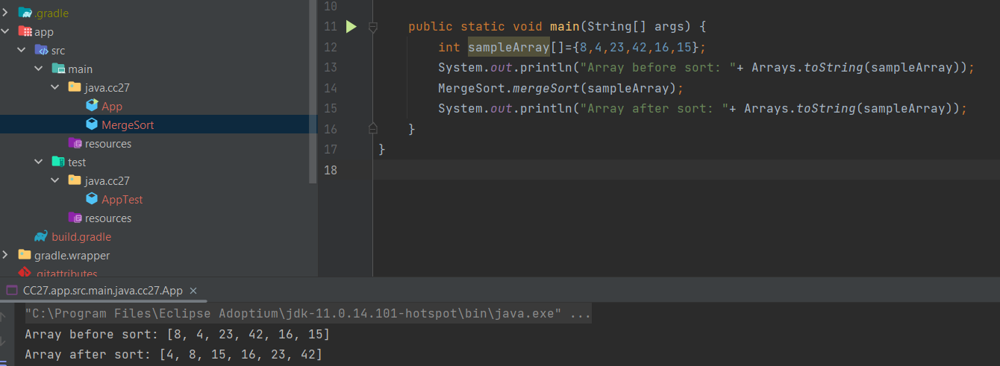

## Merge Sort
It is a high-level sorting algorithm. It divides the input array into smaller halves, sorts them, and then merges the sorted halves to produce a sorted output array.
It contains of two methods:
1. mergeSort(int [] input): it takes input array and divide it into smaller sub arrays(left and right) until there is one element is each array.
2. merge(int [] left, int [] right, int [] array): this method merge the left and right arrays into a sorted array.

## Pseudocode
`
ALGORITHM Mergesort(arr)

    DECLARE n <-- arr.length
    if n > 1
      DECLARE mid <-- n/2
      DECLARE left <-- arr[0...mid]
      DECLARE right <-- arr[mid...n]
      // sort the left side
      Mergesort(left)
      // sort the right side
      Mergesort(right)
      // merge the sorted left and right sides together
      Merge(left, right, arr)

ALGORITHM Merge(left, right, arr)

    declare i <-- 0
    declare j <-- 0
    declare k <-- 0
    while i < left.length && j < right.length
        if left[i] <= right[j]
            arr[k] <-- left[i]
            i <-- i + 1
        else
            arr[k] <-- right[j]
            j <-- j + 1

        k <-- k + 1

    if i = left.length
       set remaining entries in arr to remaining values in right
    else
       set remaining entries in arr to remaining values in left
`

## Blog Article

| Recursive Call | Parameters Sent             | Current Array           | Return Value |
|----------------|-----------------------------|-------------------------|--------------|
| Initial Call   | mergeSort(arr)              | [8, 4, 23, 42, 16, 15] | -            |
| Recursive Call 1 | mergeSort(left)             | [8, 4, 23]           | -            |
| Recursive Call 2 | mergeSort(left)             | [8]                  | -            |
| Recursive Call 3 | mergeSort(right)            | [4]                  | -            |
| Merge 1 | merge(left, right, arr)      | [4, 8]               | [4, 8]       |
| Recursive Call 4 | mergeSort(right)            | [23]                 | -            |
| Merge 2 | merge(left, right, arr)      | [4, 8, 23]           | [4, 8, 23]   |
| Recursive Call 5 | mergeSort(right)            | [42, 16, 15]         | -            |
| Recursive Call 6 | mergeSort(left)             | [42]                 | -            |
| Recursive Call 7 | mergeSort(right)            | [16, 15]             | -            |
| Recursive Call 8 | mergeSort(left)             | [16]                 | -            |
| Recursive Call 9 | mergeSort(right)            | [15]                 | -            |
| Merge 3 | merge(left, right, arr)      | [15, 16]             | [15, 16]     |
| Merge 4 | merge(left, right, arr)      | [15, 16, 42]         | [15, 16, 42] |
| Merge 5 | merge(left, right, arr)      | [4, 8, 15, 16, 23, 42] | [4, 8, 15, 16, 23, 42] |

Initial Call: The initial call to mergeSort(arr) starts with the unsorted array [8, 4, 23, 42, 16, 15]. No return value is provided at this stage.

Recursive Call 1: The initial call divides the array into left = [8, 4] and right = [23, 42, 16, 15]. The algorithm proceeds to sort left.

Recursive Call 2: In this call, the array left is further divided into left = [8]. No further division is possible, so this single-element array is considered sorted.

Recursive Call 3: For the array right, it is divided into right = [4]. Similarly, this single-element array is considered sorted.

Merge 1: The Merge function is called to merge the sorted left and right arrays into a sorted array [4, 8].

Recursive Call 4: The array right from Recursive Call 1 is divided into right = [23]. This single-element array is considered sorted.

Merge 2: The Merge function merges the sorted left and right arrays from Recursive Call 1 into a sorted array [4, 8, 23].

Recursive Call 5: The original right from the initial call is divided into left = [42] and right = [16, 15]. The algorithm proceeds to sort left.

Recursive Call 6: The array left is divided into left = [42], which is a single-element array and is considered sorted.

Recursive Call 7: The array right is divided into right = [16, 15]. The algorithm proceeds to sort this portion.

Recursive Call 8: The array left from Recursive Call 7 is divided into left = [16], a single-element array considered sorted.

Recursive Call 9: The array right from Recursive Call 7 is divided into right = [15], also a single-element array considered sorted.

Merge 3: The Merge function merges the sorted left and right arrays from Recursive Call 7 into a sorted array [15, 16].

Merge 4: The Merge function merges the sorted left and right arrays from Recursive Call 5 into a sorted array [15, 16, 42].

Merge 5: The Merge function merges the sorted arrays from Recursive Call 2, Recursive Call 4, and Merge 4 into a single final sorted array [4, 8, 15, 16, 23, 42].

- Final output: sorted array [4, 8, 15, 16, 23, 42]

## Efficiency
Time complexity: O(n log n)
Space complexity: O(n)

## Solution
