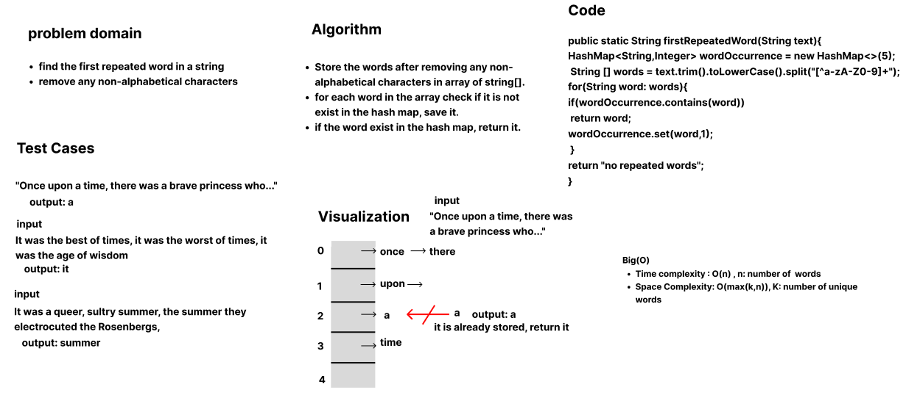
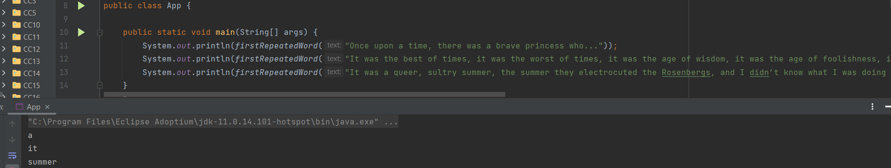

## first-repeated-word

This is a function uses Hashmap to find the first occurrence word in a string.

## Whiteboard process

## Approach and Efficiency

- Store the words after removing any non-alphabetical characters in array of string[].
- for each word in the array check if it is not exist in the hash map, save it.
- if the word exist in the hash map, return it.
- Time complexity : O(n) , n: number of  words
- Space Complexity: O(max(k,n)), K: number of unique words

## Solution

