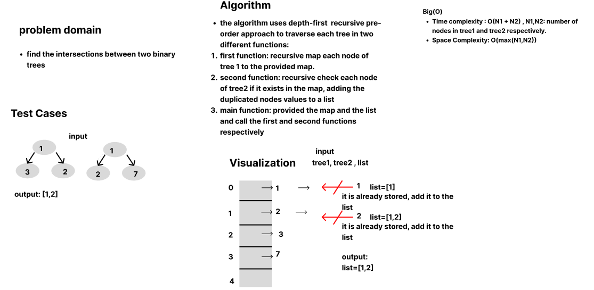
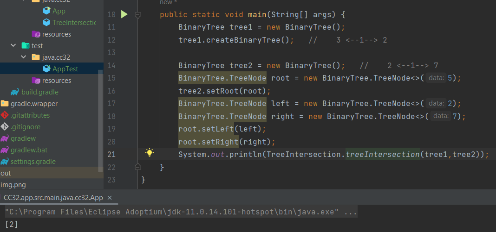

## Tree Intersections
Finding the Intersections (similar values) in two binary trees using Hashmap.

## Whiteboard process

## Code
  
    public static List<Integer> treeIntersection(BinaryTree tree1,BinaryTree tree2){
        HashMap<Integer,Integer> map = new HashMap<>(50);
        List<Integer> treesIntersection= new ArrayList<>();
        recursivePreorderMappingTree1(tree1.getRoot(),map);
        recursivePreorderCheckIntersectionTree2(tree2.getRoot(),map,treesIntersection);
        return treesIntersection;
    }
    public static void recursivePreorderMappingTree1(BinaryTree.TreeNode root, HashMap map){
        if(root==null)
            return;
        map.set((Integer) root.getData(),1);
        recursivePreorderMappingTree1(root.getLeft(),map);
        recursivePreorderMappingTree1(root.getRight(),map);
    }
    public static void recursivePreorderCheckIntersectionTree2(BinaryTree.TreeNode root, HashMap map,List<Integer> treesIntersection){
        if(root==null)
            return;
        if(map.contains((Integer) root.getData()))
            treesIntersection.add((Integer)root.getData());
        recursivePreorderCheckIntersectionTree2(root.getLeft(),map,treesIntersection);
        recursivePreorderCheckIntersectionTree2(root.getRight(),map,treesIntersection);
    }

## Approach and Efficiency

The algorithm uses depth-first  recursive pre-order approach to traverse each tree in two different functions:
1. first function: recursive map each node of tree 1 to the provided map.
2. second function: recursive check each node of tree2 if it exists in the map, adding the duplicated nodes values to a list
3. main function: provided the map and the list and call the first and second functions respectively

- Time complexity : O(N1 + N2) , N1,N2: number of  nodes in tree1 and tree2 respectively.
- Space Complexity: O(max(N1,N2))

## Solution

