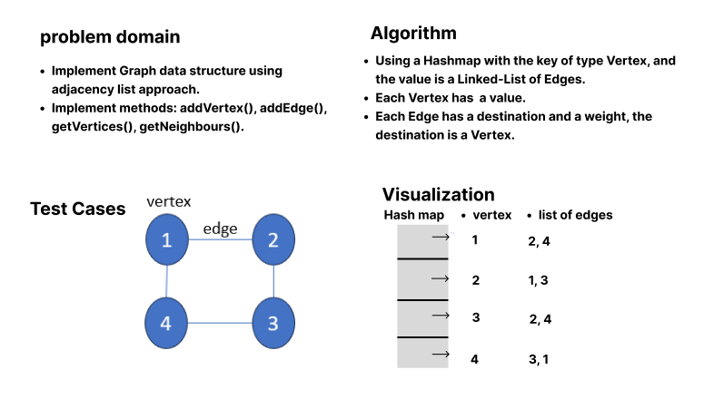
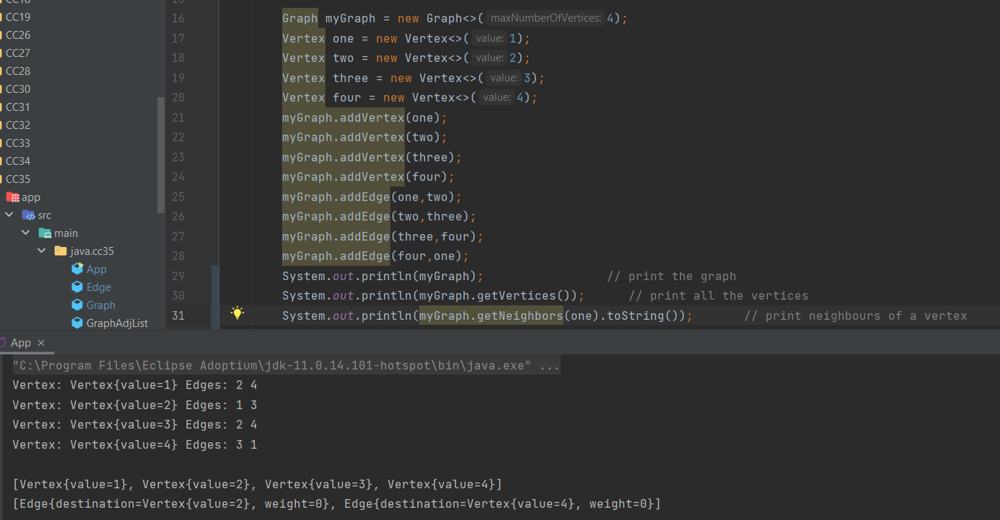
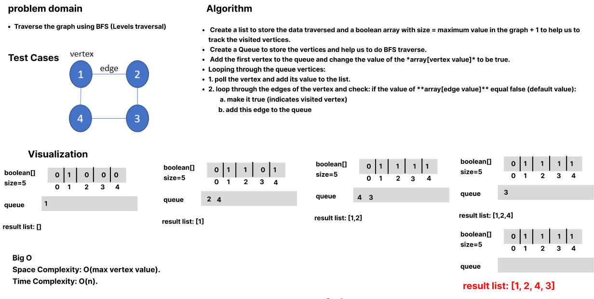
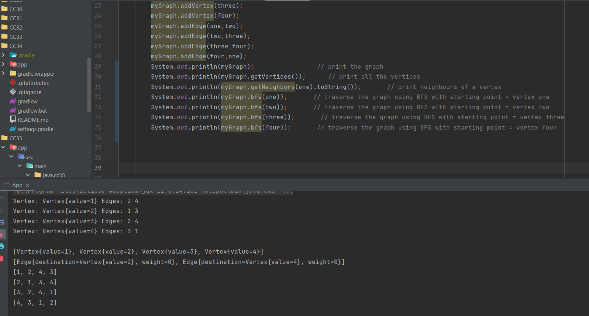
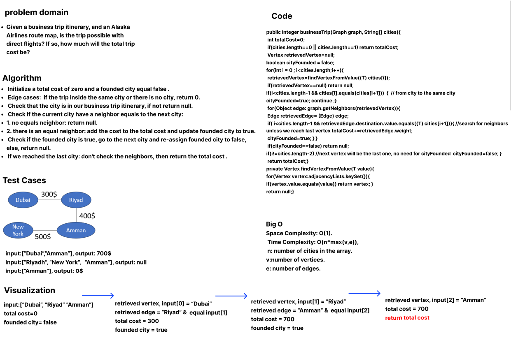
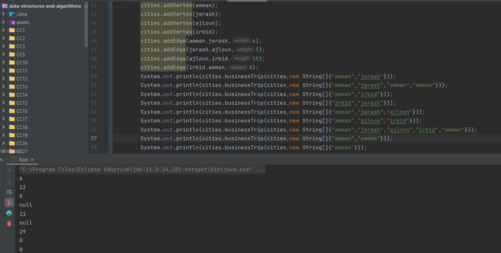

## Graph Implementation

Implement a graph using adjacency list, and implement these methods: addVertex(), addEdge(), getVertices, getNeighbours().
- It uses a Hashmap with the key of type Vertex, and the value is a Linked-List of Edges.
- Each Vertex has  a value.
- Each Edge has a destination and a weight, the destination is a Vertex.

## Whiteboard process

## addVertex()
Arguments: Vertex, Returns: The added vertex.

## Approach and Efficiency
- It takes the vertex and use the `put` function to put the vertex and a value of empty linked list.
- Space Complexity: O(n), n: number of vertices.
- Time Complexity: O(1).

## addEdge()
Arguments: two vertices: start and destination, Returns: none.

## Approach and Efficiency
- It checks if the vertices are present in the map using `containKeys` method.
- if they are stored in the map, two edges will be created with the value of start and destination vertices respectively.
- for the start vertex: add the destination edge to its values.
- for the destination vertex: add the start edge to its values.
- Space Complexity: O(n), n: number of vertices.
- Time Complexity: O(1).

## getVertices()
Arguments: none, Returns: a set of all vertices in the graph.

## Approach and Efficiency
- It uses `keySet()` method to retrieve a set of keys, which are vertices in the graph.
- Space Complexity: O(n), n: number of vertices.
- Time Complexity: O(1).

## getNeighbours()
Arguments: vertex, Returns: a list for the edges for this vertex.

## Approach and Efficiency
- It uses `get()` method to retrieve the value for the given vertex, which are the edges (other vertices connected to it).
- Space Complexity: O(n), n: number of vertices.
- Time Complexity: O(1).

## Solution

## BFS
this method traverse the graph level-by-level starting from a given vertex.

## Approach and Efficiency
- Create a list to store the data traversed and a boolean array with size = maximum value in the graph + 1 to help us to track the visited vertices.
- Create a Queue to store the vertices and help us to do BFS traverse.
- Add the first vertex to the queue and change the value of the **array[vertex value]** to be true. 
- Looping through the queue vertices:
1. poll the vertex and add its value to the list.
2. loop through the edges of the vertex and check: if the value of **array[edge value]** equal false *(default value)*:
 a. make it true *(indicates visited vertex)*
 b. add this edge to the queue

- Space Complexity: *O(max vertex value)*.
- Time Complexity: *O(n)*.

## Whiteboard process

## Solution

## business trip
a Graph represents cities and airline between them and a cost for the trip, given the current city and the destination city, determine either there is a possible direct flight between them or not. in case the flight is founded: return the cost for the trip.

## Approach and Efficiency
- Initialize a total cost of zero and a founded city equal false .
- *Edge cases:* if the trip inside the same city or there is no city, return 0.
- Check that the city is in our business trip itinerary, if not return null.
- Check if the current city have a neighbor equals to the next city:
1. no  equals neighbor: return null.
2. there is an equal neighbor: add the cost to the total cost and update founded city to true.
- Check if the founded city is true, go to the next city and re-assign founded city to false, else, return null.
- If we reached the last city: don't check the neighbors, then return the total cost .

- Space Complexity: *O(1)*.
- Time Complexity: *O(n*max(v,e))*, n: number of cities in the array. v:number of vertices. e: number of edges.

## Whiteboard process

## Solution

## DFS Traversal
Traverse the graph from a giving vertex using depth-first approach, the function uses a stack since it is *L-I-F-O* we can traverse the neighbors of the vertex and go to the maximum depth. 

## Approach and Efficiency
- Initialize a *list* to store the result and a boolean array with size equals the maximum value in the graph to track the visited vertices .
- Initialize a *stack* and push the given vertex.
- Iterate over the stack elements:
- Create a *temp* vertex to pop from the *stack*.
- Check if the temp value = false *(not visited)* in the boolean array:
- Convert it to ture *(visited)* and add the value to the result list.
- Iterate over the *edges* of the temp vertex and check if and value of the is not visited (equals false in the boolean array):
- Add it to the stack.
- When the *Stack* is empty: return the list.

- Space Complexity: *O(max vertex value)*.
- Time Complexity: *O(n)*.

## Whiteboard process

## Solution
