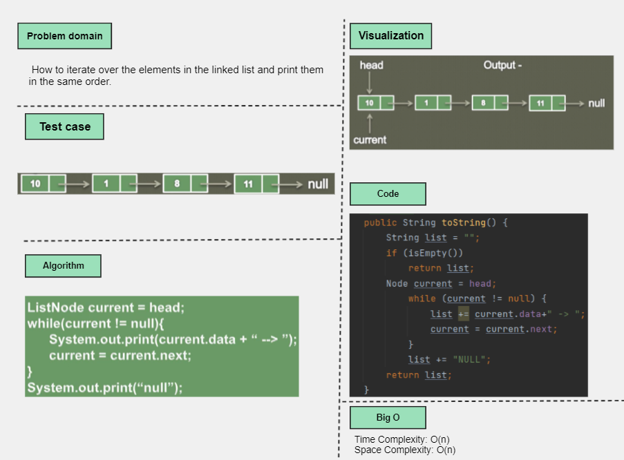
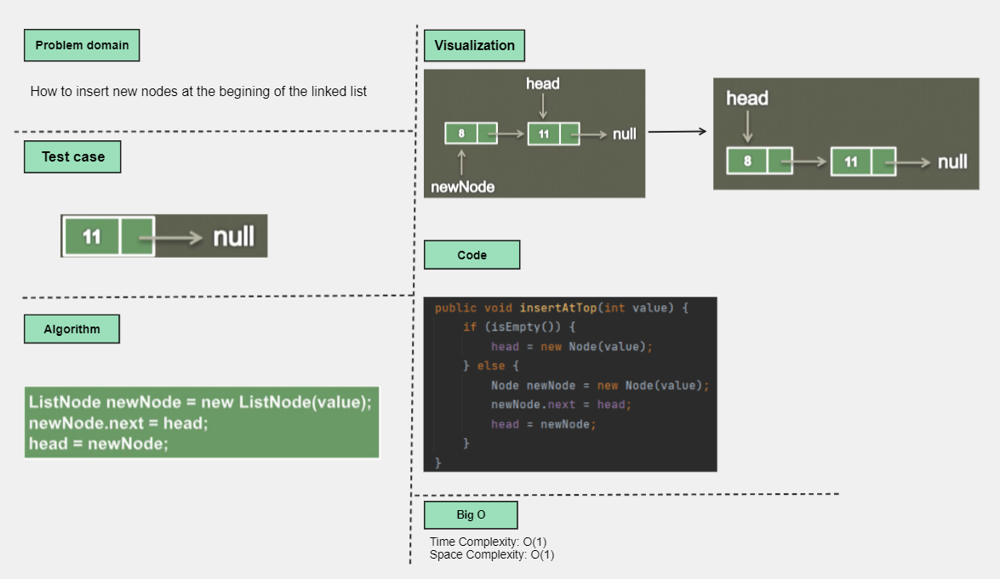
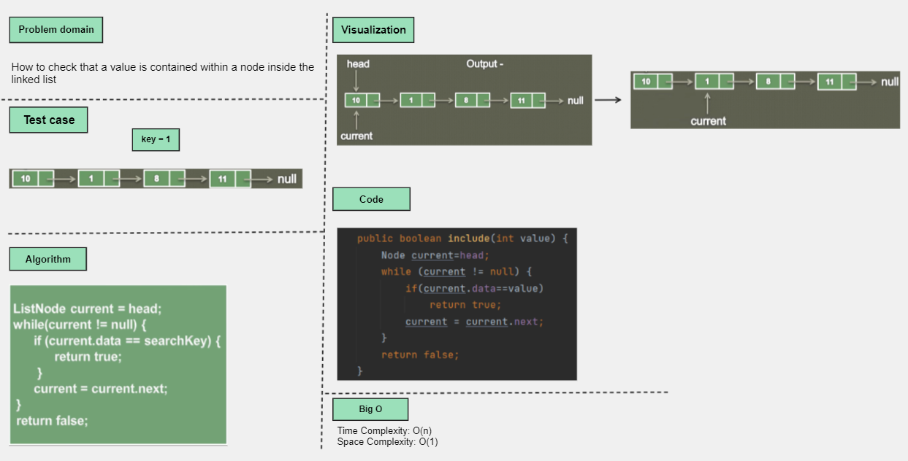
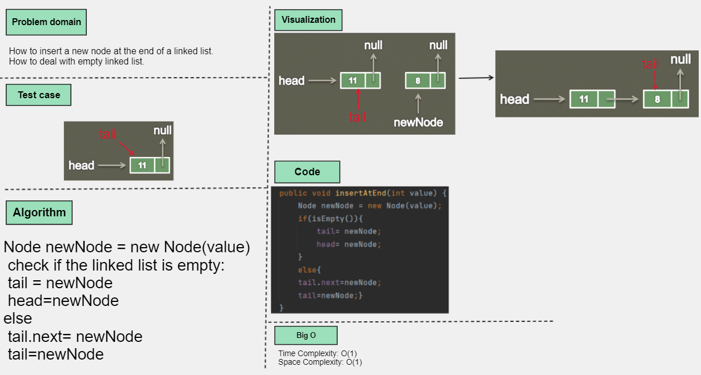
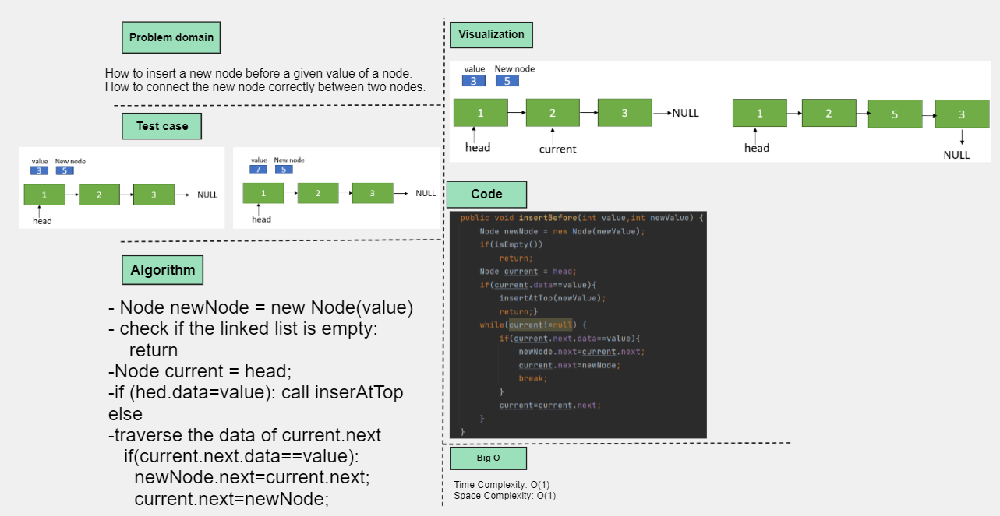
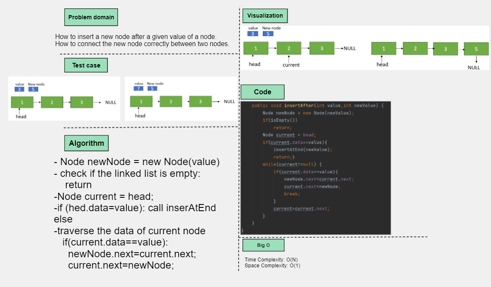
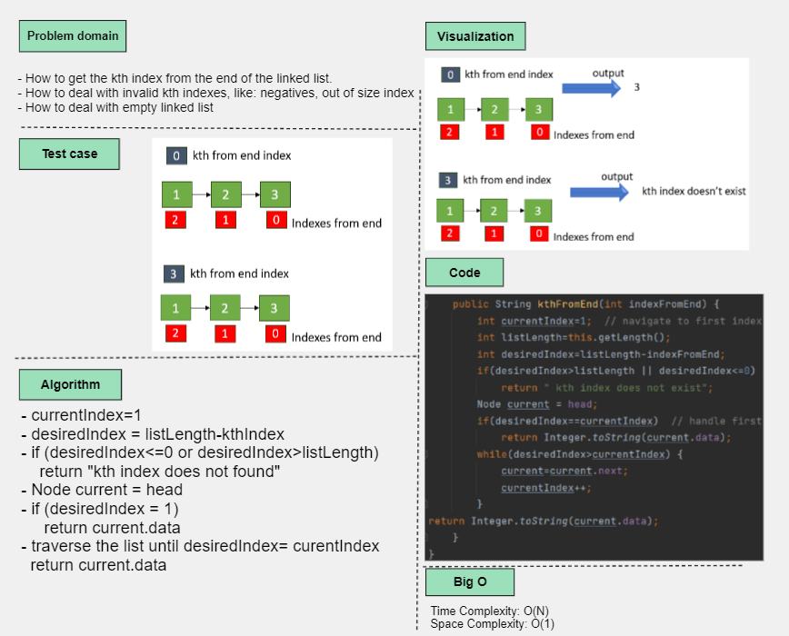
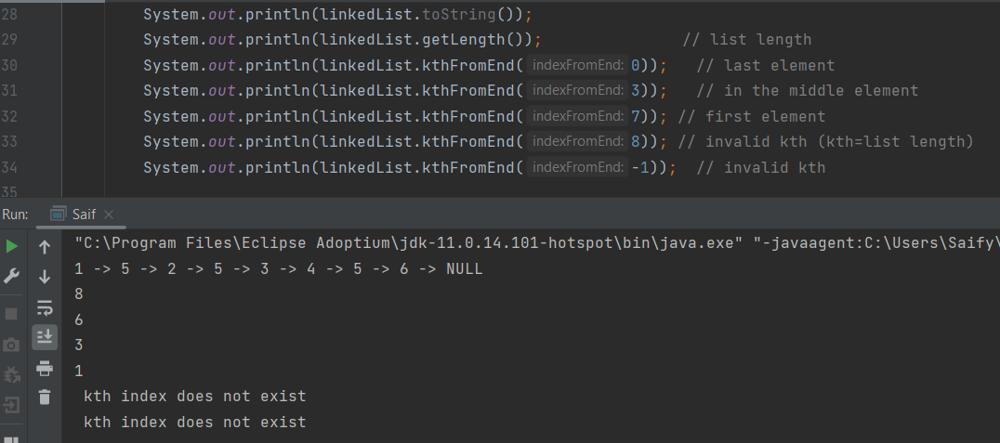

# Linked List
Linked List implementation: toString , insertAtTop, include, insertAtEnd, insertBefore, insertAfter.

## Whiteboard Process

---

## Approach and efficiency
1. Check if the linked list is empty: tail= new node.
2. if it is not empty: tail.next = new node, tail=new node.
- efficiency: time O(1), space O(1).

## Approach and efficiency
1. Node newNode = new Node(value)
2. check if the linked list is empty:
   return
3. Node current = head;
4. if (head.data=value): call insertAtTop
   else
5. traverse the data of next node
   if(current.next.data==value):
   newNode.next=current.next;
   current.next=newNode;
- efficiency: time O(n), space O(1).

## Approach and efficiency
1. Node newNode = new Node(value)
2. check if the linked list is empty:
  return
3. Node current = head;
4. if (head.data=value): call insertAtEnd
  else
5. traverse the data of current node
  if(current.data==value):
  newNode.next=current.next;
  current.next=newNode;
- efficiency: time O(n), space O(1).

## Solution

---

## Approach and efficiency
1. currentIndex=1
2. desiredIndex = listLength-kthIndex
3. if (desiredIndex<=0 or desiredIndex>listLength)
  return "kth index does not found"
4. Node current = head
5. if (desiredIndex = 1)
  return current.data
6. traverse the list until desiredIndex= curentIndex
  return current.data
- efficiency: time O(n), space O(1).
- 
## Solution 

