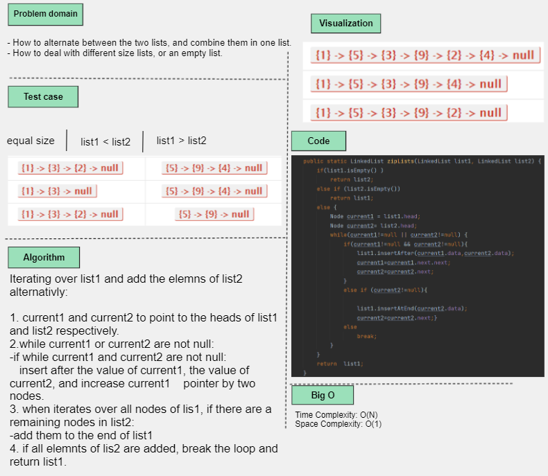
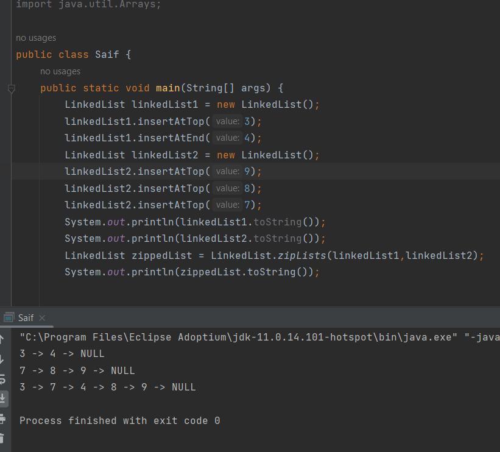
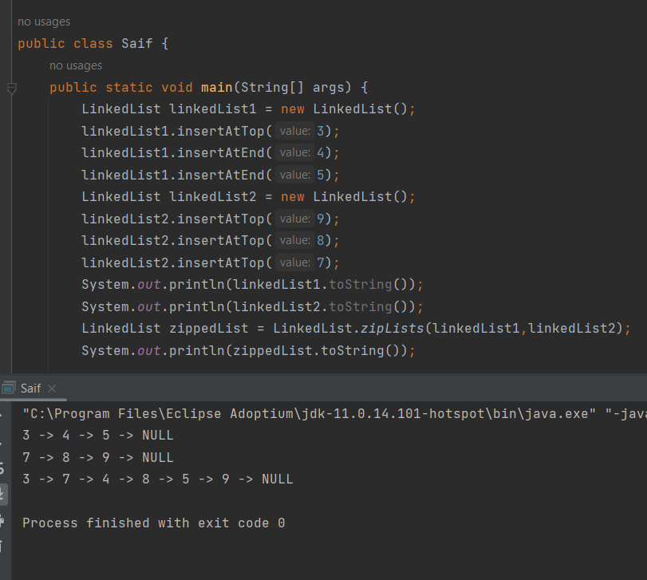
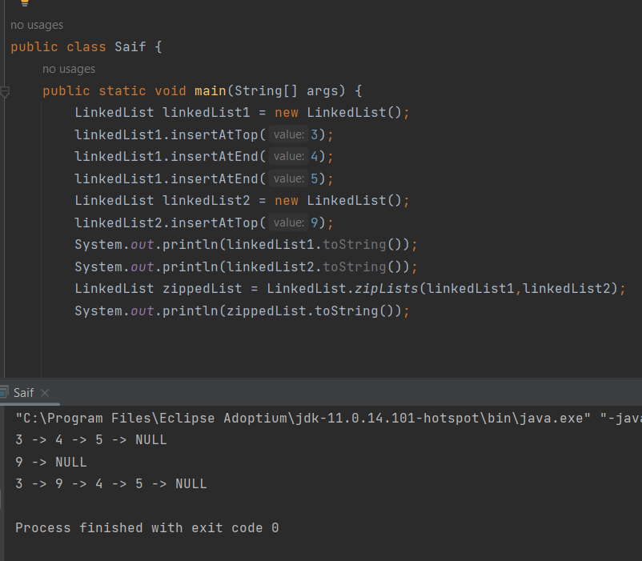
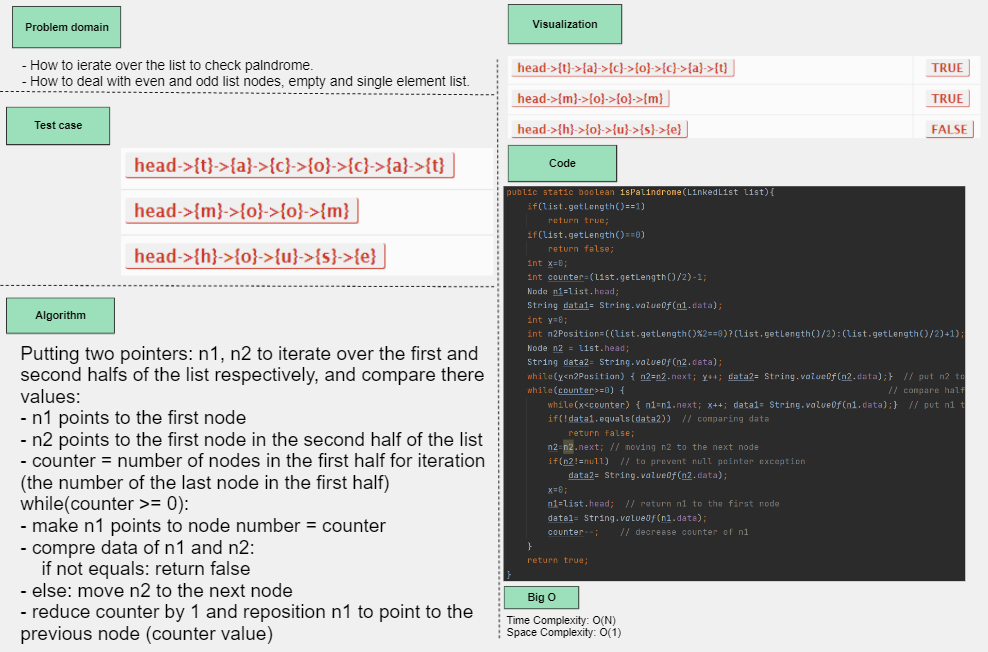
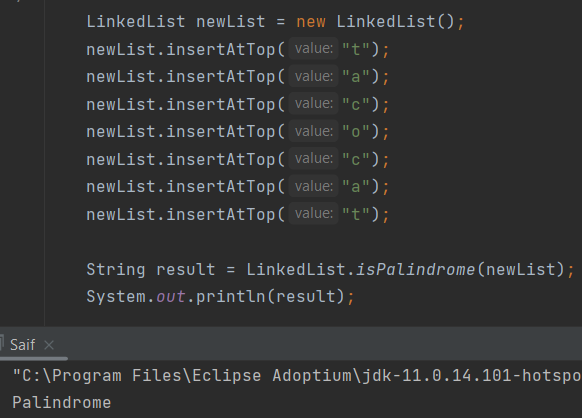
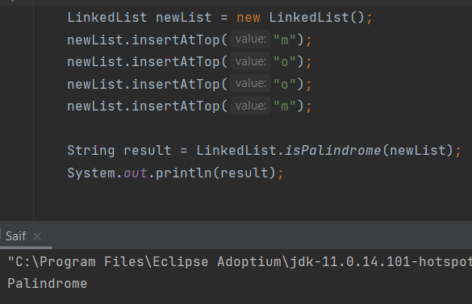
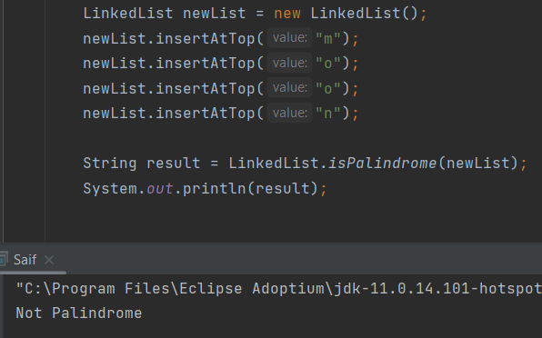

# Linked List (CC5)
Linked List implementation: toString , insertAtTop, include.

## Whiteboard Process 

---
# Linked List (CC6)
Linked List implementation: insertAtEnd , insertBefore, insetAfter.

## Whiteboard Process

## Approach and efficiency
1. Check if the linked list is empty: tail= new node.
2. if it is not empty: tail.next = new node, tail=new node.
- efficiency: time O(1), space O(1).

## Approach and efficiency
1. Node newNode = new Node(value)
2. check if the linked list is empty:
   return
3. Node current = head;
4. if (head.data=value): call insertAtTop
   else
5. traverse the data of next node
   if(current.next.data==value):
   newNode.next=current.next;
   current.next=newNode;
- efficiency: time O(n), space O(1).

## Approach and efficiency
1. Node newNode = new Node(value)
2. check if the linked list is empty:
  return
3. Node current = head;
4. if (head.data=value): call insertAtEnd
  else
5. traverse the data of current node
  if(current.data==value):
  newNode.next=current.next;
  current.next=newNode;
- efficiency: time O(n), space O(1).
## Solution

---
# Linked List (CC7)
Linked List implementation: kthFromEnd.

## Approach and efficiency
1. currentIndex=1
2. desiredIndex = listLength-kthIndex
3. if (desiredIndex<=0 or desiredIndex>listLength)
  return "kth index does not found"
4. Node current = head
5. if (desiredIndex = 1)
  return current.data
6. traverse the list until desiredIndex= curentIndex
  return current.data
- efficiency: time O(n), space O(1).
## Solution 

---
# Linked List (CC8)
Linked List implementation: zipLists.

## Approach and efficiency
Iterating over list1 and add the elements of list2 alternatively:
1. current1 and current2 to point to the heads of list1 and list2 respectively.
2. while current1 or current2 are not null:
- if while current1 and current2 are not null:
insert after the value of current1, the value of current2, and increase current1    pointer by two nodes.
3. When iterates over all nodes of lis1, if there are a remaining nodes in list2:
- add them to the end of list1
4. If all elements of lis2 are added, break the loop and return list1.
- efficiency: time O(n), space O(1).
## Solution

---
# Linked List (CC9)
Linked List implementation: isPalindrome.

## Approach and efficiency
Putting two pointers: n1, n2 to iterate over the first and second halfs of the list respectively, and compare their values:
- n1 points to the first node
- n2 points to the first node in the second half of the list
- counter = number of nodes in the first half for iteration (the number of the last node in the first half)
  while(counter >= 0):
- make n1 points to node number = counter
- compare data of n1 and n2:
  if not equals: return false
- else: move n2 to the next node
- reduce counter by 1 and reposition n1 to point to the previous node (counter value)
- efficiency: time O(n), space O(1).
## Solution

 

