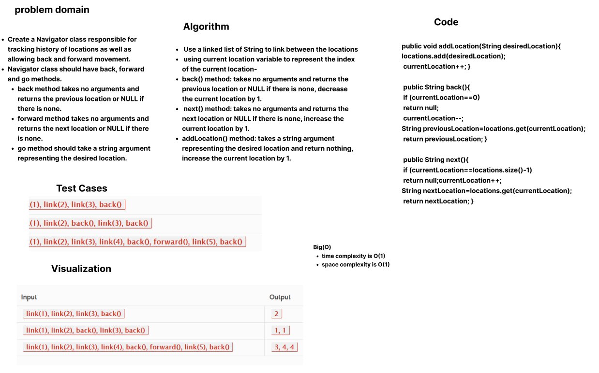
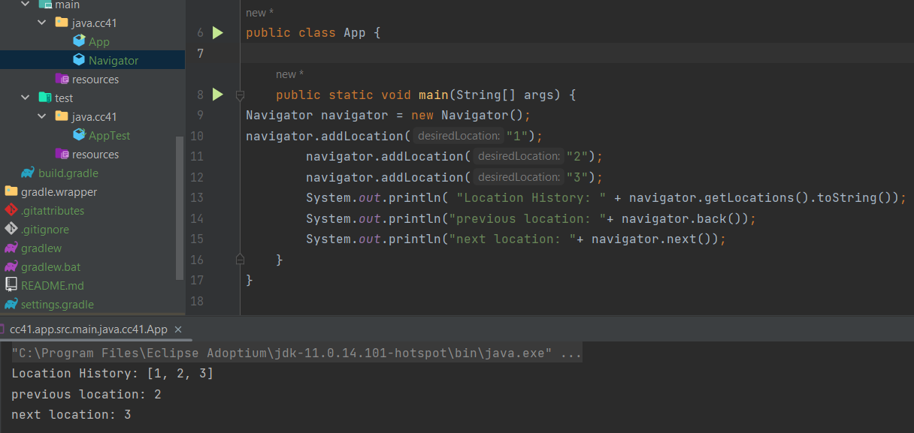

## Navigation
Navigator class responsible for tracking history of locations as well as allowing back and forward movement.

## Approach and Efficiency
- Use a linked list of String to link between the locations
- using current location variable to represent the index of the current location
- *back() method:*
- takes no arguments and returns the previous location or NULL if there is none, decrease the current location by 1.
- *next() method:*
- takes no arguments and returns the next location or NULL if there is none, increase the current location by 1.
- *addLocation() method:*
- takes a string argument representing the desired location and return nothing, increase the current location by 1.
-  Overall Space and Time Complexity: *O(1)*.

## Whiteboard process

## Solution
